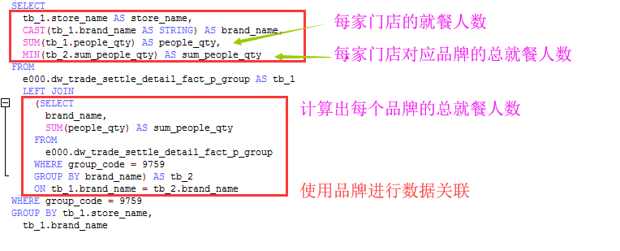

## 1、同环比计算实现逻辑说明
同环比计算正式实现思想，根据请求条件，组装同环比计算SQL，这里涉及到多级连接查询，因此
需要为每一个结果集起别名，最后连接结果进行计算。

代码实现时会有一个表别名生成工具，会根据规则 tb_[序号]，顺序生成表别名。这里的难点在于拼接SQL的过程
中什么时间需要为字段加别名？什么时间不需要为字段加别名？关联条件怎么处理？

此文档仅简单阐述同环比SQL的拼接要点，因为代码逻辑相对复杂暂不能用文字描述详尽，具体细节可参考代码中的注释。
### 1.1、同环比计算维度中包含日期
维度中包含日期时，指标的同环比计算是根据维度中的日期字段进行计算的。
#### 1.1.1、时间为年月日情况
时间为年月日的情况下，SQL中可直接使用函数进行加减运算，无需额外处理，因此相对简单，此处以年环比为例进行说明。
##### 1.1.1.1、每个门店每个营业年支付金额环比
通过join查询，将本年与去年（去年加1年）数据对齐，然后进行表达式计算，这里使用了 COALESCE 函数，当字段为null时视为0处理。
最外层查询页面需要展示的最终数据，内层查询计算同环比


#### 1.1.2、时间为季周情况
时间为季周的情况下，最终呈现的日期需要进行中文格式化，因此SQL语句中使用简单函数已无法满足，需要拼接相应
的中文方能满足需求。所以此种情况相对以上情况，有一些区别。
##### 1.1.2.1、每个门店每个营业季度支付金额环比
营业季度与按周计算一样，查询项和连接条件中都需要使用表达式，因为最终展示要用中文


### 1.2、同环比计算自定义日期
#### 1.2.1、自定义一对时间段
自定义一对时间段，根据基数时间段和对比时间段，分别计算出所需数值，然后利用连接查询计算增长值或增长率


#### 1.2.2、自定义普通时间段
自定义普通时间，根据基数时间和对比时间，分别计算出所需数值，然后利用连接查询计算增长值或增长率


## 2、百分比计算
### 2.1、无维度条件情况
无维度条件情况下，指标的百分比值皆为100%


```
SELECT
  CAST(store_name AS STRING) AS `ljc_compare_x_store_name1554271077000_0`,
  MIN(1) AS `ljc_sum_x_real_income1554277395000_0`
FROM
  e000.dw_trade_settle_detail_fact_p_group
WHERE group_code = 9759
GROUP BY `ljc_compare_x_store_name1554271077000_0`
```
### 2.2、有维度条件情况
有维度条件情况下，指标的百分比计算的分母值要先根据维度条件计算，然后计算一个总和作为分母


### 2.3、对比情况下百分比
此种情况实现思路，根据请求条件拼接SQL，不同于非对比情况实现，百分比计算在对比项反转时计算。所以SQL中
需要计算出算子的值及作为分母的值。

主SQL根据维度、对比条件，计算出算子（分子）；子SQL，根据对比条件分组，计算出算子（分母）；
SQL根据对比条件关联，使对应的分子与分母数据对齐。


```
+--------------------------+--------------+------------+----------------+
| store_name               | brand_name   | people_qty | sum_people_qty |
+--------------------------+--------------+------------+----------------+
| 受气牛肉阳光世纪店       | 受气牛肉     | 46456      | 125128         |
| 李子坝梁山鸡北碚万达店   | 李子坝梁山鸡 | 68050      | 816568         |
| 李子坝梁山鸡磁器口店     | 李子坝梁山鸡 | 7363       | 816568         |
| 李子坝梁山鸡长嘉汇店     | 李子坝梁山鸡 | 107493     | 816568         |
| 李子坝梁山鸡渝北店       | 李子坝梁山鸡 | 88745      | 816568         |
| 三斤耗儿鱼北仓店         | 三斤耗儿鱼   | 58722      | 158662         |
| 东涮西烤渝北店           | 东涮西烤     | 31582      | 31582          |
| 受气牛肉弹子石老街店     | 受气牛肉     | 69244      | 125128         |
| 李子坝梁山鸡九龙滨江店   | 李子坝梁山鸡 | 55645      | 816568         |
| 三斤耗儿鱼九龙滨江店     | 三斤耗儿鱼   | 17508      | 158662         |
| 受气牛肉磁器口店         | 受气牛肉     | 9428       | 125128         |
| 李子坝梁山鸡阳光世纪店   | 李子坝梁山鸡 | 59965      | 816568         |
| 李子坝梁山鸡老店         | 李子坝梁山鸡 | 148757     | 816568         |
| 受气牛肉水晶郦城店       | 李子坝梁山鸡 | 9979       | 816568         |
| 李子坝梁山鸡解放碑英利店 | 李子坝梁山鸡 | 71592      | 816568         |
| 李子坝梁山鸡公园店       | 李子坝梁山鸡 | 198979     | 816568         |
| 三斤耗儿鱼东原1891店     | 三斤耗儿鱼   | 82432      | 158662         |
+--------------------------+--------------+------------+----------------+

```

