## 1、同环比计算实现逻辑说明
同环比计算正式实现思想，根据请求条件，组装同环比计算SQL，这里涉及到多级连接查询，因此
需要为每一个结果集起别名，最后连接结果进行计算。

代码实现时会有一个表别名生成工具，会根据规则 tb_[序号]，顺序生成表别名。这里的难点在于拼接SQL的过程
中什么时间需要为字段加别名？什么时间不需要为字段加别名？关联条件怎么处理？

此文档仅简单阐述同环比SQL的拼接要点，因为代码逻辑相对复杂暂不能用文字描述详尽，具体细节可参考代码中的注释。
### 1.1、同环比计算维度中包含日期
维度中包含日期时，指标的同环比计算是根据维度中的日期字段进行计算的。
#### 1.1.1、时间为年月日情况
时间为年月日的情况下，SQL中可直接使用函数进行加减运算，无需额外处理，因此相对简单，此处以年环比为例进行说明。
##### 1.1.1.1、每个门店每个营业年支付金额环比
通过join查询，将本年与去年（去年加1年）数据对齐，然后进行表达式计算，这里使用了 COALESCE 函数，当字段为null时视为0处理。
最外层查询页面需要展示的最终数据，内层查询计算同环比

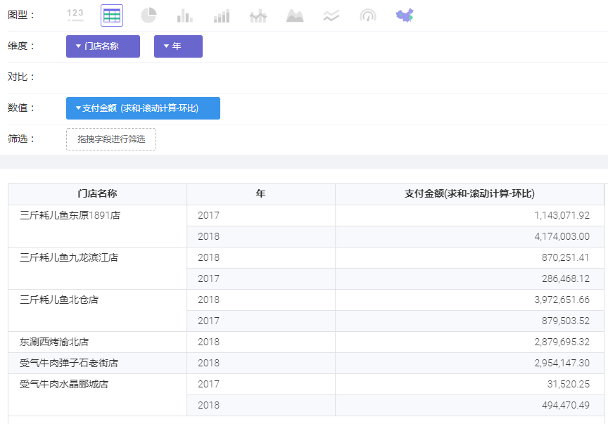

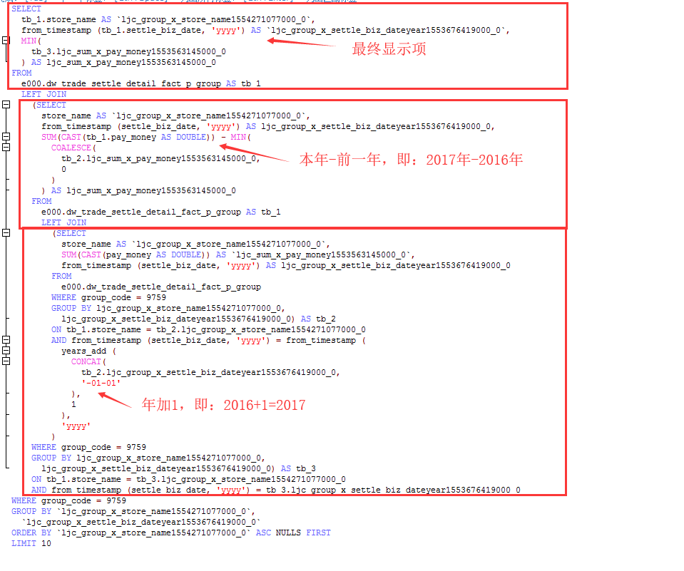
#### 1.1.2、时间为季周情况
时间为季周的情况下，最终呈现的日期需要进行中文格式化，因此SQL语句中使用简单函数已无法满足，需要拼接相应
的中文方能满足需求。所以此种情况相对以上情况，有一些区别。
##### 1.1.2.1、每个门店每个营业季度支付金额环比
营业季度与按周计算一样，查询项和连接条件中都需要使用表达式，因为最终展示要用中文

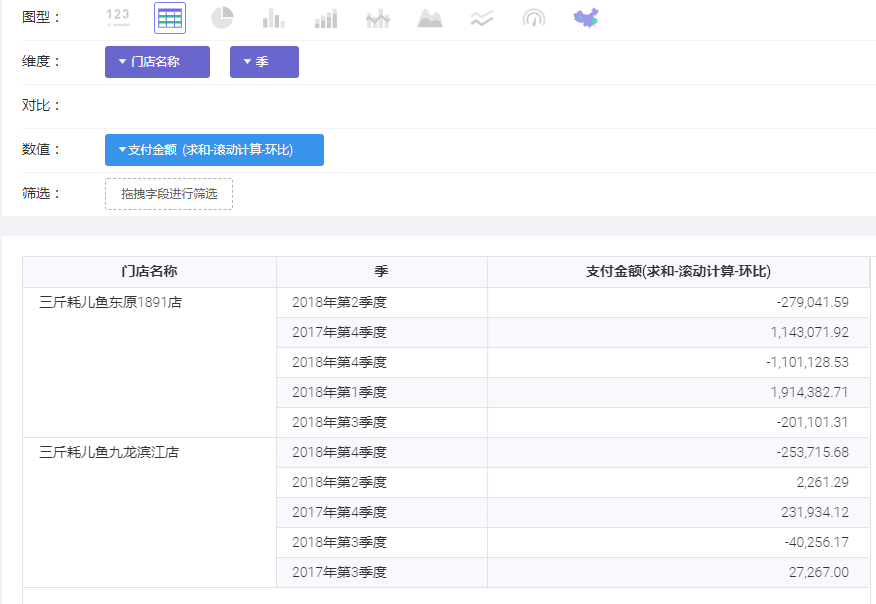

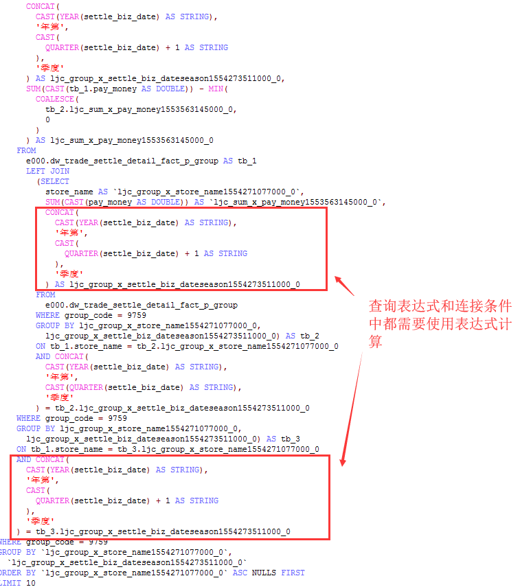

### 1.2、同环比计算自定义日期
#### 1.2.1、自定义一对时间段
自定义一对时间段，根据基数时间段和对比时间段，分别计算出所需数值，然后利用连接查询计算增长值或增长率
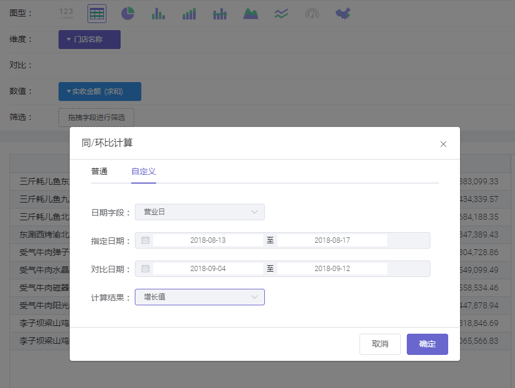
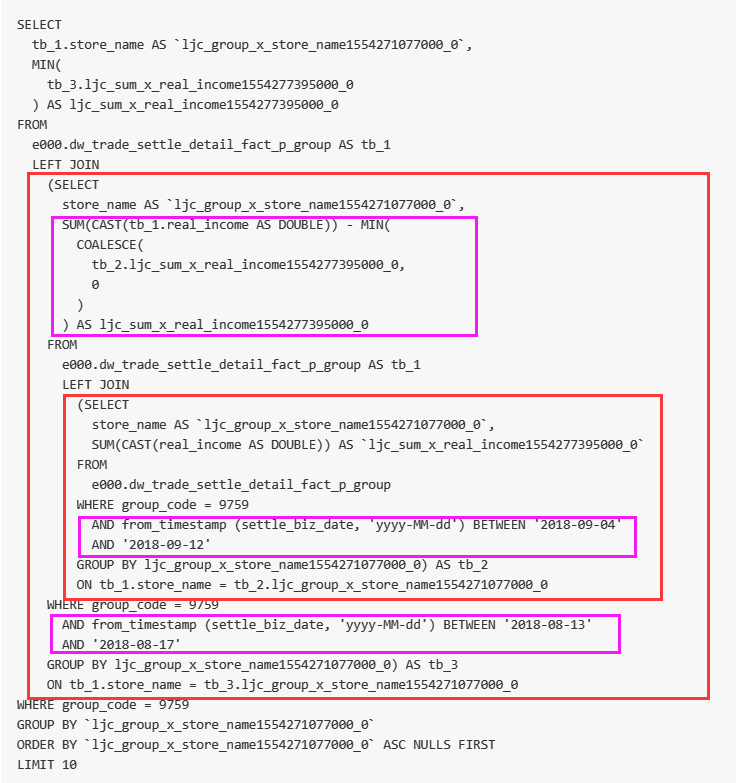
#### 1.2.2、自定义普通时间段
自定义普通时间，根据基数时间和对比时间，分别计算出所需数值，然后利用连接查询计算增长值或增长率
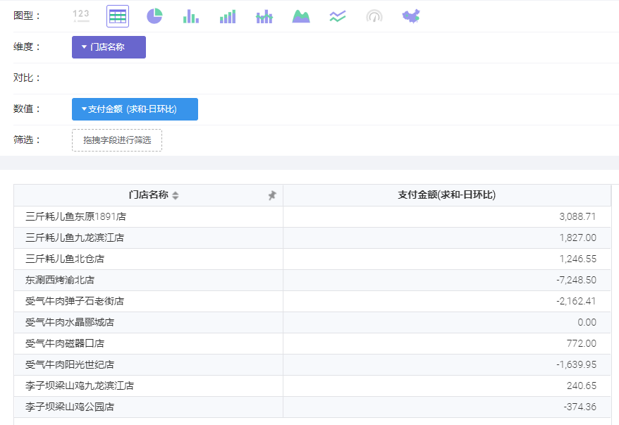
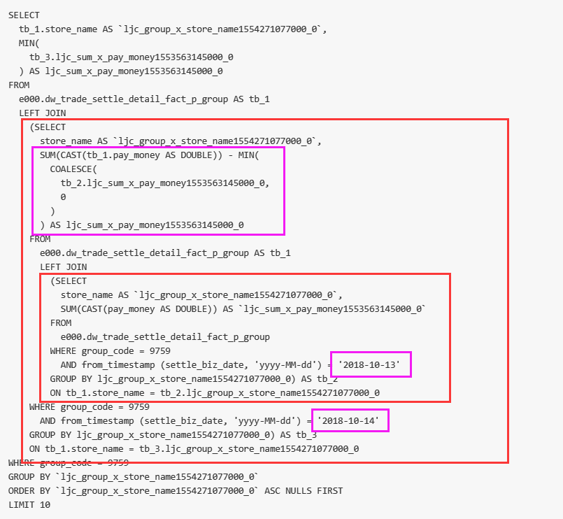

## 2、百分比计算
### 2.1、无维度条件情况
无维度条件情况下，指标的百分比值皆为100%

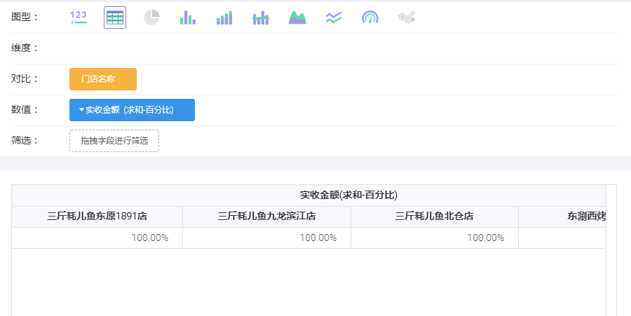

```
SELECT
  CAST(store_name AS STRING) AS `ljc_compare_x_store_name1554271077000_0`,
  MIN(1) AS `ljc_sum_x_real_income1554277395000_0`
FROM
  e000.dw_trade_settle_detail_fact_p_group
WHERE group_code = 9759
GROUP BY `ljc_compare_x_store_name1554271077000_0`
```
### 2.2、有维度条件情况
有维度条件情况下，指标的百分比计算的分母值要先根据维度条件计算，然后计算一个总和作为分母

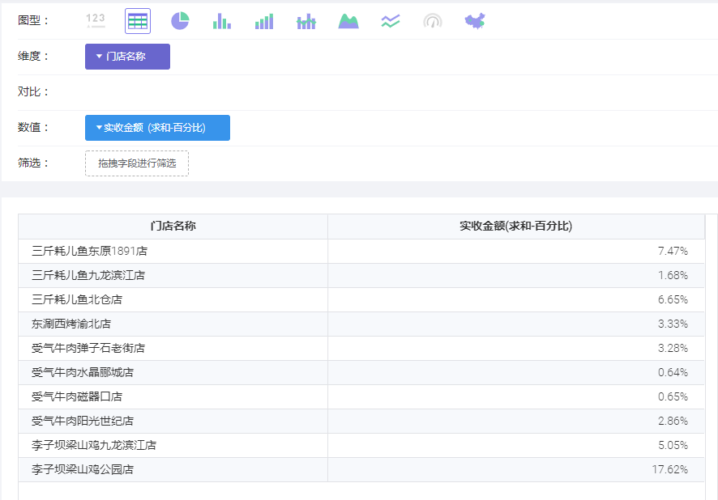

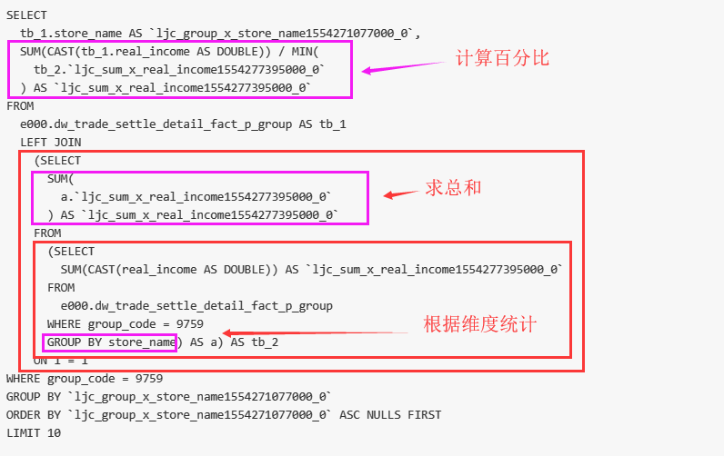